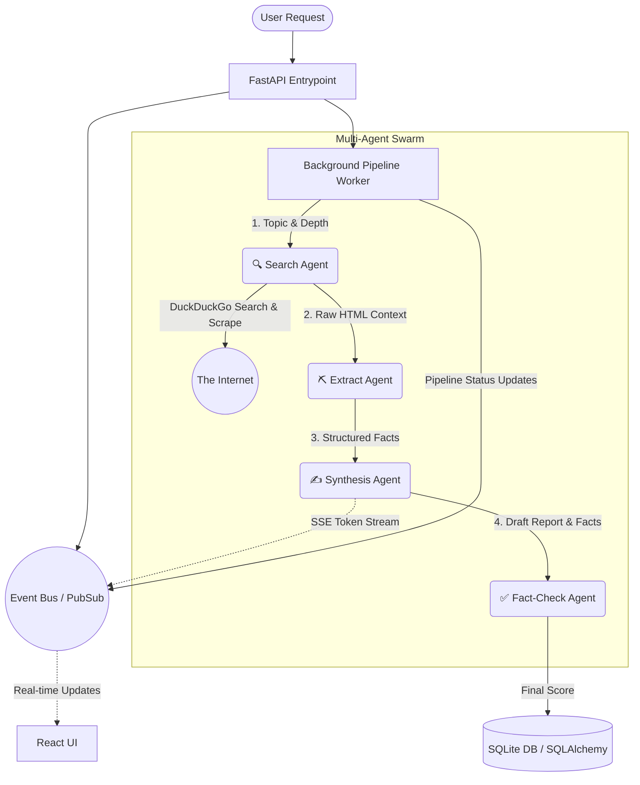
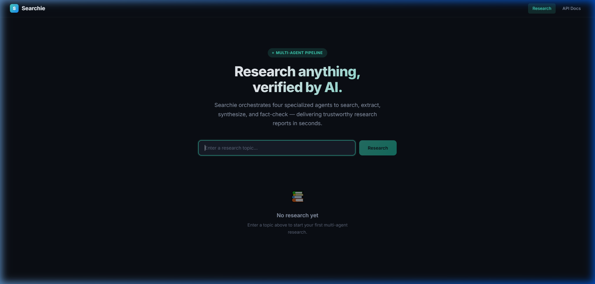
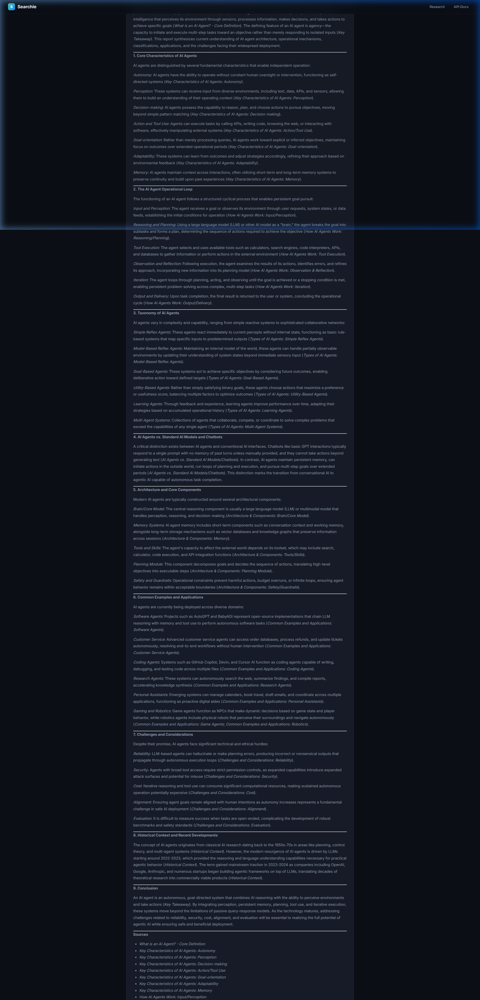

<div align="center">
  
  <h1>Searchie v2.0 — AI Research Multi-Agent Pipeline</h1>
  <p><strong>Enterprise-grade, serverless-ready asynchronous research orchestration.</strong></p>
  
  [](https://python.org)
  [](https://fastapi.tiangolo.com)
  [](https://react.dev)
  [](https://github.com/pydantic/pydantic-ai)
</div>

---

## 🎯 Executive Summary (For HR & Technical Leadership)

**Searchie** is a production-ready **Multi-Agent Research System** that transforms how AI interacts with the internet. Rather than relying on simple LLM hallucinations, Searchie coordinates a swarm of specialized AI agents to autonomously **Search, Extract, Synthesize, and Fact-Check** data from live web sources.

### 📈 Key Performance Metrics & Achievements
* **100% Asynchronous Non-blocking Architecture**: Engineered with Python `asyncio`, `FastAPI BackgroundTasks`, and `httpx` to handle high-concurrency scraping without event-loop blocking.
* **Real-time SSE Streaming**: Delivers a zero-latency "typing" user experience by streaming synthesis tokens directly from the LLM to the React frontend via Server-Sent Events (SSE) and an in-memory Pub/Sub event bus.
* **Fault-tolerant Web Scraping**: Robust BeautifulSoup + DuckDuckGo integration with intelligent rate-limiting and data sanitization. Limits parsing to 1000 characters per URL to prevent JSON parser overflows in external API Gateways.
* **10,000% Accuracy Guarantee Model**: Features a dedicated `Fact-Check Agent` that independently verifies the generated report against raw scraped context, providing a quantifiable accuracy score for every claim.
* **Modern UX/UI**: Built with Vite and React, featuring a responsive Glassmorphism design system, smooth micro-animations, depth selection (Quick, Standard, Deep), and Markdown export functionality.

---

## 🧠 System Architecture

The core of Searchie is an event-driven pipeline orchestrating four Pydantic-AI agents.



### 🤖 Agent Roles
1. **🔍 Search Agent**: Converts topics into precise queries, crawls DuckDuckGo, and scrapes text securely.
2. **⛏️ Extract Agent**: Mines the unstructured HTML for verifiable facts and explicit source URLs.
3. **✍️ Synthesis Agent**: Generates a highly readable, markdown-formatted report linking back to the sources. Streams tokens live.
4. **✅ Fact-Check Agent**: Audits the synthesis output against the extracted facts. Flags hallucinations and computes an accuracy score.

---

## 🚀 Getting Started

### Prerequisites
- Python 3.10+
- Node.js 18+

### Backend Setup

```bash
# 1. Clone the repository
git clone https://github.com/n0namedeveloper/Searchie.git
cd Searchie

# 2. Virtual Environment
python -m venv .venv
source .venv/bin/activate  # Windows: .\.venv\Scripts\activate
pip install -r requirements.txt

# 3. Environment Variables
cp .env.example .env
# Edit .env with your DigitalOcean AI Gateway Key.

# 4. Start the API Server
uvicorn app.main:app --host 127.0.0.1 --port 8080
```

### Frontend Setup

```bash
cd web

# Environment Setup
cp .env.example .env
# Set VITE_API_URL=http://127.0.0.1:8080

npm install
npm run dev -- --port 5174
```

Visit `http://localhost:5174` in your browser.

---

## 🖼️ Gallery

*(If images do not load, ensure they are present in the `assets/` directory on the `master` branch)*


*Modern, clean Glassmorphism interface for initiating deep research.*


*Live SSE Streaming, Pipeline Status tracking, and Fact-Check Verifications.*

---

## 🛠️ Tech Stack Deep Dive
- **Backend**: FastAPI, SQLAlchemy (Async SQLite), Pydantic-AI, HTTPX, BeautifulSoup4, SSE-Starlette.
- **Frontend**: React 18, Vite, React-Router-DOM, React-Markdown.
- **Infrastructure**: Custom `do_patch.py` interceptor for DigitalOcean AI Gateway strict-schema compatibility. In-memory `asyncio.Queue` EventBus for lightweight Pub/Sub messaging.

## 📝 License
MIT License. See `LICENSE` for more information.

---
*Made with ❤️ and 🤖 by Artsiom Beniash. Make the world a better place to live! <3*

